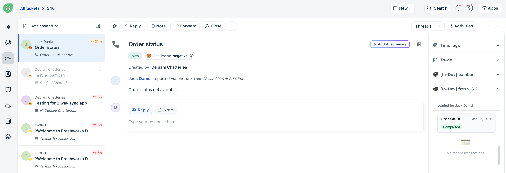

# Support Shield Lens: Multi-OAuth Integration: BigCommerce & PayPal
=============================================

A high-fidelity **Freshworks Platform v3** reference app demonstrating multi-provider authentication. It consolidates e-commerce data (BigCommerce) and payment history (PayPal) into the Freshdesk ticket sidebar.



---


📋 Table of Contents
--------------------

-   [Overview](https://www.google.com/search?q=%23overview)

-   [Key Features](https://www.google.com/search?q=%23key-features)

-   [Architecture: Multi-OAuth Flow](https://www.google.com/search?q=%23architecture-multi-oauth-flow)

-   [Platform v3 Features](https://www.google.com/search?q=%23platform-v3-features)

-   [Feature to Implementation Mapping](https://www.google.com/search?q=%23feature-to-implementation-mapping)

-   [Project Structure](https://www.google.com/search?q=%23project-structure)

-   [Setup Guide](https://www.google.com/search?q=%23setup-guide)

-   [Resources](https://www.google.com/search?q=%23resources)

* * * * *

🚀 Key Features
---------------

### 1\. Unified Customer 360 View

Consolidates disparate data points into a single sidebar pane. Agents can view BigCommerce customer profiles and PayPal transaction statuses without switching tabs, reducing **Average Handle Time (AHT)**.

### 2\. Intelligent Order Tracking

Automatically retrieves the **last 3 orders** associated with the ticket requester's email. Displays order status, total value, and fulfillment updates in real-time.

### 3\. Transaction Verification

Integrates with the PayPal Transaction Search API to fetch payment details within a 31-day window, allowing agents to verify refund requests or payment failures instantly.

### 4\. Hybrid Authentication Engine

Demonstrates a robust auth-switch capability:

-   **OAuth 2.0 Authorization Code** for BigCommerce (User-delegated).

-   **OAuth 2.0 Client Credentials** for PayPal (System-to-system).

* * * * *

🏗 Architecture: Multi-OAuth Flow
---------------------------------

This app serves as a blueprint for managing multiple distinct authentication lifecycles within a single serverless environment.

### 1\. BigCommerce (Authorization Code Grant)

-   **Flow**: Handled natively by the Platform via `oauth_config.json`.

-   **Engineering Rationale**: Leverages platform-managed token rotation and encryption for store-level data access.

### 2\. PayPal (Client Credentials Grant)

-   **Flow**: Manual server-side token exchange using Client ID/Secret.

-   **Engineering Rationale**: Demonstrates dynamic token generation for services requiring system-to-system authentication rather than user-delegated access.

* * * * *

🔗 Feature to Implementation Mapping
------------------------------------

| **Functionality** | **Platform Module** | **Path** | **Engineering Rationale** |
| --- | --- | --- | --- |
| **Data Orchestration** | Serverless (SMI) | `server/server.js` | Aggregates data from two disparate APIs in a single async operation to reduce frontend overhead. |
| **API Abstraction** | Request Templates | `config/requests.json` | Centralizes endpoint definitions; uses dynamic context injection for store hashes and tokens. |
| **Automated Context** | Event Handlers | `server/server.js` | Uses `onTicketCreate` to pre-fetch customer history, reducing perceived latency for the agent. |
| **Sidebar Injection** | App Locations | `manifest.json` | Embeds real-time purchase context directly into the agent's primary workflow. |

* * * * *

📂 Project Structure
--------------------

Plaintext

```
.
├── app/                        # Frontend Assets (Crayons UI)
│   ├── index.html              # App View Container
│   ├── scripts/app.js          # Interface API & SMI Invocation
│   └── styles/style.css        # Sidebar-specific UI overrides
├── config/                     # Configuration & Auth
│   ├── iparams.json            # Secure Credential Definitions
│   └── oauth_config.json       # BigCommerce OAuth Scopes & Endpoints
├── server/                     # Serverless Logic
│   └── server.js               # Multi-OAuth Orchestration & Event Handlers
├── manifest.json               # App Capabilities & Module Definitions
└── requests.json               # Declarative API Request Templates

```

* * * * *

🛠 Setup Guide
--------------

### 1\. BigCommerce Prerequisites

-   **Store Hash**: Locate in your URL: `store-{hash}.mybigcommerce.com`.

-   **Scopes**: Ensure your API Account has `read-only` access to **Customers**, **Orders**, and **Store Information**.

### 2\. PayPal Sandbox

-   Create an app in the [PayPal Developer Dashboard](https://www.google.com/search?q=https://developer.paypal.com/).

-   Retrieve **Client ID** and **Secret**. Note: Transaction Search is limited to 31-day windows.

### 3\. App Installation

1.  **Clone & Install**:

    Bash

    ```
    fdk run

    ```

2.  **OAuth Handshake**: Complete the BigCommerce OAuth flow in the installation settings page.

3.  **Local Test**: Open a ticket in Freshdesk and append `?dev=true` to the URL.

* * * * *

⚠️ Troubleshooting
------------------

| **Error** | **Cause** | **Resolution** |
| --- | --- | --- |
| **403 Forbidden** | Missing BigCommerce Scopes | Update API Account to include `read-only` Customer/Order scopes. |
| **404 openresty** | Incorrect Store Hash | Verify the `bigcommerce_store_hash` in your `iparams`. |
| **PayPal Range Error** | Date window > 31 days | Adjust the `start_date` in `requests.json` to be within 31 days of `end_date`. |

* * * * *

📚 Resources
------------

-   [Freshworks V3 Documentation](https://developers.freshworks.com/docs/apps/v3/)

-   [Platform OAuth Integration Guide](https://developers.freshworks.com/docs/apps/v3/oauth/)

-   [BigCommerce Dev Center](https://www.google.com/search?q=https://developer.bigcommerce.com/)

-   [PayPal API Reference](https://www.google.com/search?q=https://developer.paypal.com/docs/api/overview/)

* * * * *
